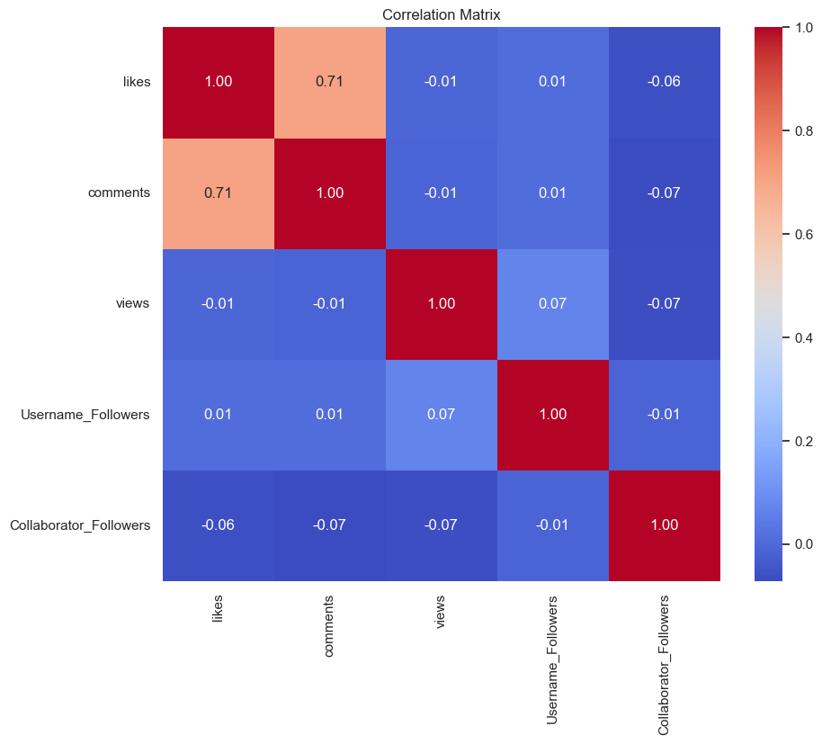
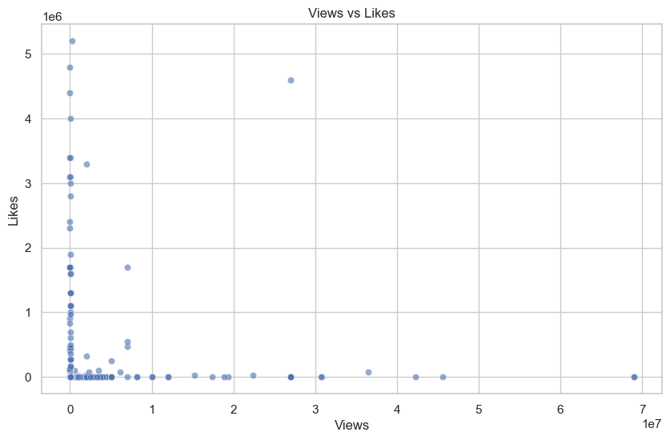

# Instagram Data Analysis Report

## 1. Descriptive Statistics
|                        |   count |             mean |              std |   min |   25% |    50% |      75% |         max |
|:-----------------------|--------:|-----------------:|-----------------:|------:|------:|-------:|---------:|------------:|
| likes                  |     411 | 201688           | 714746           |     0 |     4 |    322 |   3017   |     5.2e+06 |
| comments               |     411 |    770.847       |   3247.26        |     0 |     0 |      0 |     21.5 | 29400       |
| views                  |     412 |      2.07472e+06 |      7.36488e+06 |     0 | 15725 |  80850 | 527750   |     6.9e+07 |
| Username_Followers     |     420 | 258392           | 470611           |  2991 | 39100 | 125500 | 298250   |     6.6e+06 |
| Collaborator_Followers |     149 |  85609.3         | 119647           |   276 |  7756 | 105000 | 105000   |     1.4e+06 |

## 2. Correlation Matrix

## 3. Views vs Likes

## 4. Top 5 Posts by Views
| Rank | Views | Likes | User | URL |
|---|---|---|---|---|
| 225 | 69,000,000 | 3 | nan | [Link](https://www.instagram.com/reel/DHi60wmTzqF/?igsh=MTRqeGd4b2ExMndteg==) |
| 301 | 69,000,000 | 20 | aswathirejith | [Link](https://www.instagram.com/reel/DLmc8cwRSH-/) |
| 311 | 45,600,000 | 2 | being_a_food_vlogger_ | [Link](https://www.instagram.com/reel/DJOLHonPKTp/) |
| 224 | 42,300,000 | 17 | deepu_payal_cute_couple | [Link](https://www.instagram.com/reel/DHi6eiJTZrF/?igsh=MTgzZXp3Yjdwam9lZA==) |
| 58 | 36,500,000 | 83,300 | chitrasfoodbook | [Link](https://www.instagram.com/p/DO-9GQxgcxn/) |
